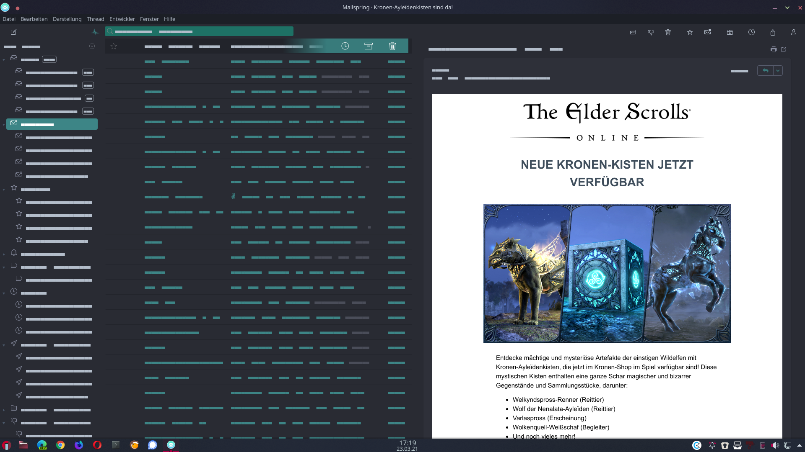

Dark Theme for Mailspring with green colors 
Summary 📍 A fresher theme inspired by the KDE-Plasma Desktop Environment Themes with a splashof green colors 
💻 Easy to install into Mailspring; 🎉 Open source 
How to install the theme into Mailspring 
1. Download the zip file by clicking on the green Clone or download button at the top right of the repo. 
2. Unzip the file that was downloaded into one folder of your choise. 
3. Open Mailspring 
4. Open the Mailspring menu EDIT of Mailspring 
5. Click on Install Theme. 
6. Find the downloaded Theme in your folder and click on it 
7. Click the blue choose button and the theme will load 
8. A Popup will shown up if you’re done 🎉 

License Licensed under the Mailsping-Theme-Starter by Foundry 376, LLC I hope you like the theme and share with some friends. https:/
github.com/hanny00?tab=repositories 

Mailspring Theme Starter 
The Mailspring Theme Starter is a basic starting point for creating a theme for the Mailspring email client. 
 
Getting Started 
Creating a new theme in Mailspring is easy! Here’s how you can do it. 
Fork this repo or download the code. Add a name, display name, title, and description for your theme to package.json, and change the
directory name to match.
Open Mailspring and install the theme by going to Mailspring > Install New Theme... and selecting the directory.
Choose Developer > Run With Debug Flags for easier debugging.
Now, you can start playing with the theme! It’s installed in ~/Library/Application Support/Mailspring/packages/THEME_NAME (on
macOS), so open it from there. Most of Mailspring’s React components are derived from the core variables defined in ui-variables.less,
and any changes you make there will override the defaults for Mailspring. You can also add more LESS files in styles (ideally, separated
into logical components like thread-list.less) to make your own specific changes. To reload the theme, just open the console
(Developer > Toggle Developer Tools) and type 
AppEnv.themes.setActiveTheme('ui-light');
AppEnv.themes.setActiveTheme('your-theme-name');

Once you’re happy with your theme, check how it looks in the theme picker (Mailspring > Change Theme...). We use your UI variables
to pull the colors, but if you want to add your own selections to the color palette, create a theme-colors.less file that includes any of the
variables that you want to change, and they’ll only affect the theme preview. Here are the variables, on the left, with the part of the theme
preview that they match: 
@background-secondary: BACKGROUND_COLOR
@text-color: TEXT_COLOR, FIRST_SWATCH_COLOR
@component-active-color: MIDDLE_SWATCH_COLOR
@toolbar-background-color: LAST_SWATCH_COLOR
@panel-background-color: STRIP_COLOR

Structure 
.
├── styles # All stylesheets
| ├── index.less # Main LESS file to import your stylesheets
│ ├── ui-variables.less # UI variables that override N1's defaults
│ ├── theme-colors.less # Theme colors for theme preview (optional)
├── package.json # Metadata about the theme
├── LICENSE.md # License with usage rights
└── README.md # Info about your theme and how to use it
